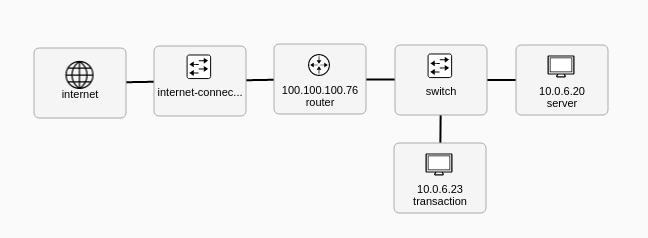

# Cybersecurity CTF on Kypo

This project is a Kypo sand box definition repo. we followed the Kypo game project "https://gitlab.ics.muni.cz/muni-kypo-trainings/games/junior-hacker"  to implement this project. 

This is the sandbox network topology: 

**The transaction vm:** 

ip: 10.0.6.23

username/password: kali/kali

**The challenge vm:** 

ip:10.0.6.20

username/password: admin/admin

The answer for the question to finished the training progerss: 

start-training 

